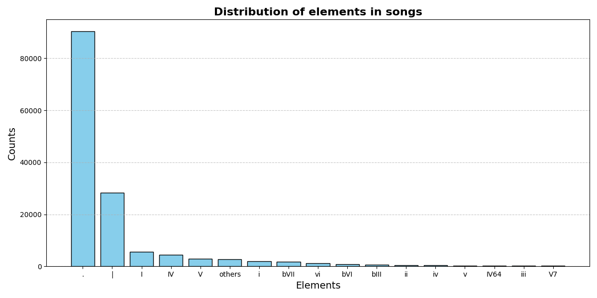
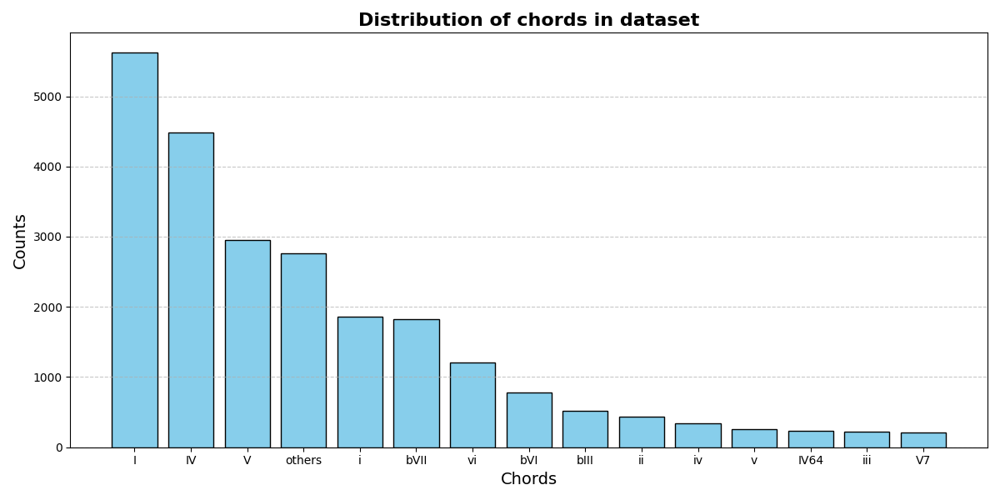

# Rock your LSTM

This project has been developed by **_Sergio Cárdenas Gracia_** & **_Siddharth Saxena_** in the context of the Valerio Velardo's "Computational Music Creativity" course from the Master in Sound and Music Computing at Universitat Pompeu Fabra. For more information, refer to the [Assigment.md](Assignment.md) file.

The goal of this project is to develop and train an LSTM (Long Short-Term Memory) model that generates rock chord progressions. Two types of models have been implemented:

- **Chords Model**: Generates rock chord progressions without considering temporal dependencies, producing sequences of chords.

- **Songs Model**: Generates rock songs by considering temporal dependencies, producing chord progressions for an entire song.


## Preprocessing the dataset

The first step is to preprocess the data from the [Rock Corpus Version 1.1](https://rockcorpus.midside.com/) dataset, converting it into a format suitable for training the models. To preprocess the data, follow these steps:

```bash
>>> cd scripts
>>> cc expand6.c -o expand6
>>> python preprocess.py
```

### Explanation of the steps:

1. Navigate to the `scripts/` folder where all required scripts are stored.

2. Compile the `expand6.c` file, which contains utilities for preprocessing the dataset.

3. Run the `preprocess.py` script, which:

    - Preprocesses the dataset and saves the training data in the `data/training/` folder. 
    - Analyzes and visualizes the dataset distribution. Results are stored in the `data/processed/` folder. 

### Visualizations

The dataset analysis produces two visualizations:

1. **Songs Dataset Distribution**: Displays the frequency distribution of elements in the dataset, where:
    - Roman numerals represent chords.
    - `.` represents sustained notes or rests.
    - `|` indicates bar splits.

2. **Chords Dataset Distribution**: Displays the frequency distribution of chords in the dataset.

<div style="display: flex; justify-content: left; gap: 10px;">
  
  
</div>
<br/>

These plots help us understand the dataset's structure and how it influences the models' functionality.

## Training the models

The LSTM models can be trained using the `train.py` script. To do so, run the following command from the `scripts/` folder:

```bash
>>> python train.py
```

The models will be saved in the `models/` folder. The `train.py` script includes parameters that can be tuned to experiment with different configurations. The default values have been found to work well for the scope of this project.

## Generating chords

Once the models are trained, the `chordgenerator.py` script can be used to generate new rock songs or rock chord progressions. Use the following command from the `scripts/` folder:

```bash
>>> python chordgenerator.py
```

### Output

The script generates two outputs:

1. **Generated Song**:

```
I . . . | vi . . . | I . . . | IV . . . | I . . . | iii . . . | IV . . . | V . . . | I . . . | IV . . . | I . . . | . . . . | . . . . | iii . . . | IV . . . | . . . . | . . . . | V . . . | I . . . | IV . . . | . . . . | I . . . | V . . . | . . . . | I . . . | vi . . . | I . . . | IV . . . | I . . . | iii . . . | IV . . . | V . . . | I . . . | . . . . | IV . . . | V . . . | I . . . | . . . . | IV . . . | V . . . | I . . . | . . . . | IV . . . | V . . . | I . . . | . . . . | IV . . . | . . . . | iii . . . | . . . . |
```

2. **Generated Chord Progression**:

```
vi | II | IV | I | vi | V | IV | I | vi | V | vi | I | vi | V | I | vi | IV | I | vi | IV | I | vi | II | IV | V | vi | II | IV | V | vi | II | IV | V | I | vi | IV | I | vi | IV | I | vi | II | IV | V | vi | II | IV | V | vi | II
```

### Parameters

The `chordgenerator.py` script has different parameters that can be tuned:

- **Seed**: Allows conditioning the generation with an initial chord sequence. By default, no initial chord sequence is provided, making the generation unconditioned.

- **Number of Bars/Chords**: Specifies the length of the generated output.

- **Temperature**: Controls the randomness of the generation. Lower values make the output more deterministic, while higher values make it less predictable.

## Observations

The generated sequences exhibit patterns consistent with the training dataset:

**Songs Model**:

- Generated sequences often include sustained chords, with common chords being the tonic (I), dominant (V), and subdominant (IV).

**Chords Model**:

- Outputs are heavily dominated by rock chords like I, IV, and V, reflecting their prevalence in the dataset.

These results align with the characteristics of rock music, demonstrating that the models capture the underlying structure of the training data effectively.